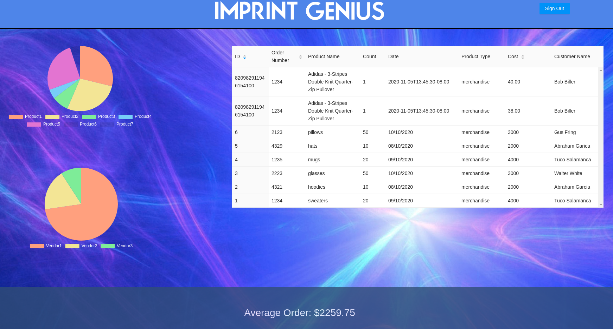

# imprintgeniuswebapp

### A client dashboard web app for Impact Genius' customers

This project has been deployed to:
[https://imprintgenius-webapp.herokuapp.com/dashboard](https://imprintgenius-webapp.herokuapp.com/dashboard)

### Overview
Our project goal was to create a dashboard that takes information about a user's Imprint Genius stories and consolidates it into one page. Our dashboard displays a table showing all the information on a user's orders, as well as some graphs to demonstrate that information visually. It also includes some statistics about the order at the bottom of the screen.
Each user has their own dashboard, so we needed each user to have their own login information. As a result, we created a login page for users to enter their credentials and log in to their dashboard page.

### Features
- We used the MERN stack to build our web application.
- Both the login page and dashboard page consist of multiple react components that serve different purposes.
- Data about our user's order information is stored in a MongoDB database, and we use that information to populate the tables and charts in the dashboard.
- We used Firebase Authentication to handle the user sign-in functionality.
- Express was used to handle the routing between the two pages.

### Members:
- Eric Ho
- Mahan Mahtabfar
- Jonathan Riego
